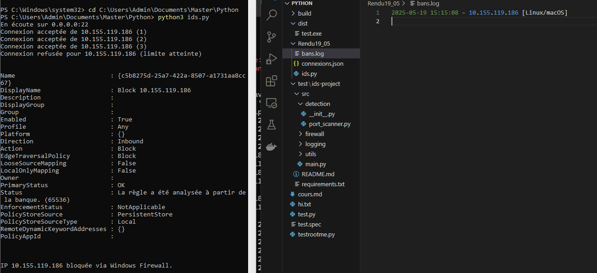

# IDS (Intrusion Detection System)

Ce projet est un système de détection d'intrusion (IDS) simple écrit en Python. Il surveille les connexions entrantes sur un port spécifique (par défaut le port 22, utilisé pour SSH) et applique des règles pour détecter et bloquer les adresses IP suspectes.

## Fonctionnalités

- **Surveillance des connexions** : Le script écoute les connexions entrantes sur le port spécifié.
- **Blocage des IP suspectes** : Si une adresse IP dépasse un seuil de connexions (par défaut 3), elle est automatiquement bloquée.
- **Détection du système d'exploitation** : Le script tente d'identifier le système d'exploitation de l'attaquant en analysant le TTL (Time To Live) des paquets.
- **Journalisation** :
  - Les connexions sont enregistrées dans un fichier JSON (`connexions.json`).
  - Les IP bloquées sont consignées dans un fichier de log (`bans.log`).
- **Support multi-plateforme** : Le blocage des IP est pris en charge sur Windows, Linux et macOS.

## Prérequis

- Python 3.6 ou supérieur
- Privilèges administratifs (nécessaires pour écouter sur des ports inférieurs à 1024 et pour bloquer les IP)

### Bibliothèques Python utilisées

- `socket` : Pour écouter les connexions réseau.
- `json` : Pour gérer les fichiers de connexions.
- `subprocess` : Pour exécuter des commandes système (ex. : blocage des IP).
- `re` : Pour analyser les résultats des commandes système.
- `platform` : Pour détecter le système d'exploitation.
- `datetime` : Pour enregistrer les horodatages.

### POC Windows  

